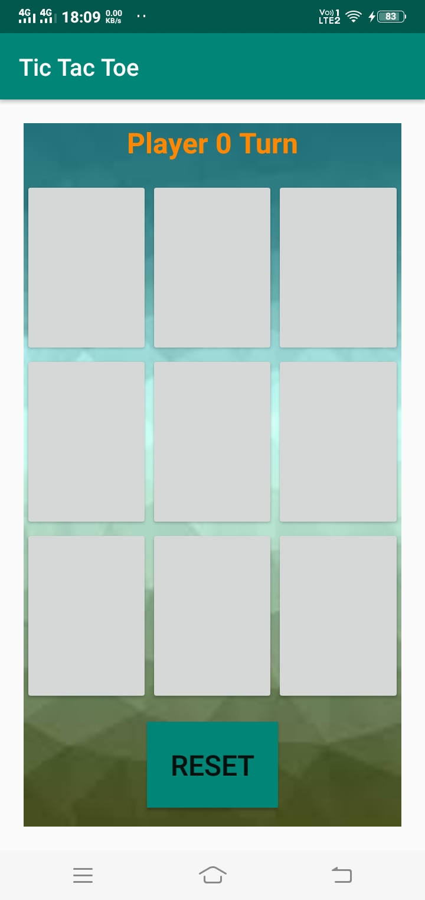
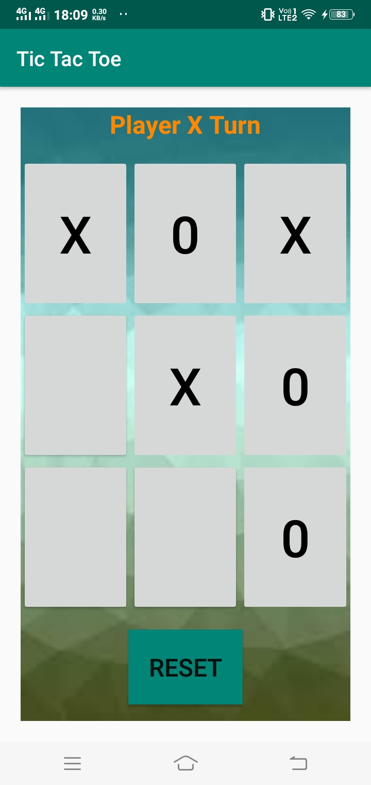
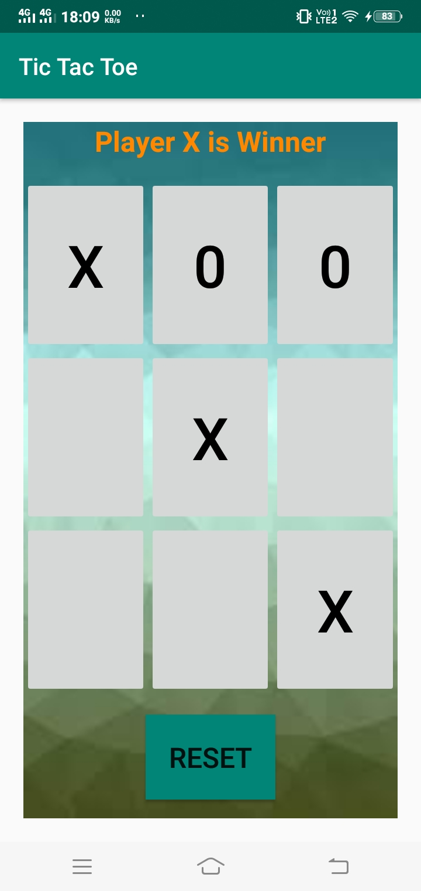

# TIC TAC TOE

## ABOUT:
Tic-tac-toe, or Xs and Os game is a paper-and-pencil game for two players, namely X and O, who take turns marking the spaces in a 3×3 grid. 
The player who succeeds in placing three of their marks in a horizontal, vertical, or diagonal row is declared as the winner. 

For more details visit: [Wikipedia](https://en.wikipedia.org/wiki/Tic-tac-toe)

## App images:

  

## Add Project to Desktop:
1) Open Android Studio App.
2) Follow the steps: File > New > Project from Version Control..
3) In the Box that appears:

    i) Select Version Control as Git from the drop down menu.
    
    ii) In the Url box, paste this url: https://github.com/souvikcode/TicTacToe.git .
    
    iii) In the directory, browse the directory where you want.
    
    iv) Select Clone.
    

## How to play:
  The turn of the player will appear alternatively at the top of the screen. Select any of the boxes in the grid which is empty. The winner of the game is decided according
  to the general rules of the game. To rematch, click on the RESET button, it will automatically, clear the grid.
  
## Motivation to build:
   I build this game out of fun, just to save the amount of paper we waste by playing this game on paper. :)
   
## Contribution:
   Contribution by making pull request are all always welcome. 
